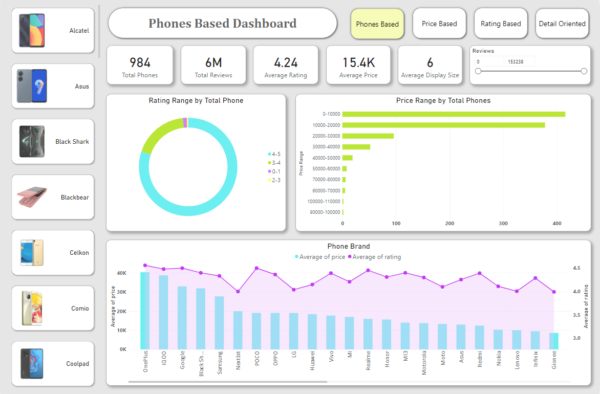

# Phone-Brands-Power-BI-Data-Analysis

## Introduction :

This is a Power BI project in which I have analysed and compared the price and ratings of different brands of the phone. In this dataset we have total 51 brands of phones with their competitive average price and ratings. In this there are some phones and some are handsets also but I have taken these two under the phone category only. In this competitive world there are lots of product with different brands available in the market. Its difficult for us to choose one with reasonable price and features as we are attracted by various real or artificial fascinating advertisements. But its difficult for us to believe on these advertisements that's why we find ratings every where in order to know the best product brand in the market. So this dashboard may help you to choose the best mobile brand with the features suits your personality. Lets get more details about the dashboard.

--------------------------------------------------------------------------------------------------------------------------------------------------------------------------------------------------------------------

## This Project Includes :

- **Data Import :** Connected data from the File and Transform it by ensuring accurate Data Type.
- **Data Cleaning and Processing :** Ensured data accuracy and consistency and by preventing duplicate data by using techniques in Power BI Query.
- **Performing Data Analysis and Interpretation :** Created meaningful Measures and additional calculated columns to have qualitative insights from the data.
- **Data Visualization :** Created various meaningful insights from Visualization Field and customized chart formatting.
- **Creation of Interactive Dashboard :** Arranged all the customized chart in the meaningful format with some additional features of the Dashboard like Buttons and Filters.

-------------------------------------------------------------------------------------------------------------------------------------------------------------------------

## Dashboard :

  

-------------------------------------------------------------------------------------------------------------------------------------------------------------------------

## Project KPI :

In this Project, the measures displays, total numbers of phone i.e. 984 phones, total reviews is 6M, average rating is 4.24, average price is 15.4K, average display size is 6 inches and the top brand based on rating is One Plus which has got 4.56 ratings from total 4050 reviews.

--------------------------------------------------------------------------------------------------------------------------------------------------------------------------------------------------------------------

## Important Questions derived from the Project :

1. What is the rating range that most of the phones has got out of 6M reviews ?
2. What is the price range of most of the phones that are available in this dataset ?
3. Which phone brand has the maximum average price with the maximum average ratings ?
4. Which type of display mode of the phone is maximum sold in the market with the expensive price ?
5. Which type of display mode of the phone is the best one based on ratings in the market ?
6. Which display size is mostly sold in the market with maximum average price ?
7. Which display size has got the maximum average ratings in the market ?
8. Which ROM size is highly popular in the market with maximum average price ?
9. Which ROM size has got the maximum average rating than others ?
10. Which RAM size is highly popular in the market with the expensive price ?
11. Which RAM size has got the maximum average rating than others ?
12. Which expandable plan of the phone is mostly popular and is really expensive in the market ?
13. Which expandable plan has got the maximum ratings than others ?
14. Which warranty period is common and expensive in the phone market ?
15. Which warranty period has got the maximum ratings ?
16. What is the most common range of battery hours in the market with the expensive price ?
17. Which battery hour range has got the maximum average ratings ?
18. Which type of battery mode of the phone is maximum sold and expensive in the market ?
19. Which type of battery mode of the phone is the best one based on ratings in the market ?
20. Which processor of the phone is highly popular in the market based on total quantity sold, average price and average ratings ?
21. Which front camera of the phone is mostly sold with higher price and maximum ratings ?
22. Which rear camera of the phone is mostly sold with higher price and maximum ratings ?

--------------------------------------------------------------------------------------------------------------------------------------------------------------------------------------------------------------------

## Based on the report Insights, here are the outcomes :

This Dashboard consists of 4 pages operated by Page Navigators beside the name of the Dashboard, these are Phone based Dashboard, Price based Dashboard, Ratings based Dashboard & Detail Oriented Dashboard.

1. The rating range from 4 to 5 is the most common range that most of the phone has got in the market whereas from 2 to 3 rating range is the least in the market for phones like Blackbear, Micromax, YUHO and Zen.

2. The price range ends with 10000 is the most common in the market and these are mostly handsets at affordable price whereas the phones starts from 90000-100000 are the least sold in the market as these are the expensive phones mostly for richer section of the group.

3. The phones of brand One Plus is the best model according to this dataset as this has earned maximum average ratings in the market and also has the maximum average price than others whereas in case of price Ziox brand has the least average price but average rating is above the least and YUHO brand has the least average ratings than others.

4. In the market, Full HD+ Display mode is maximum sold in the market as its quantity sold is higher than others but its average price is lower than the maximum. The mode that has the maximum price range is Quad HD+ Display whereas HVGA Display has the least price in the market.

5. According to this dataset, the display mode that has got the highest average ratings than others is Quad HD+ Display which is equally have highest average price than others. Hence is the best display mode in the market whereas HVGA Display has got the least rating than others.

6. The display size from 6 to 7 inches is maximum sold in the market and its average price is also very high than others whereas display size starting from 2 to 3 inches has the least price in the market.

7. The display size starting from 6 to 7 inches has got the maximum average ratings in the market than others whereas the display size from 3 to 4 inches has got the least average ratings.

8. The ROM size with 64 GB is highly popular in the market with greater sale but has lesser price than the highest whereas the ROM size with 512 GB is has the maximum average price than other ROM size whereas 512 MB ROM has the least average price.

9. The ROM size that has got the maximum average ratings than others is 512 GB whereas the size with the least average rating is 512 MB ROM in the market.

10. The RAM size with 4 GB is highly popular in the market but has lesser average price than the maximum. The RAM size with 12 GB has the maximum average price than others whereas 32 MB RAM has the least average price in the market.

11. The RAM size that has got the maximum average ratings than others is 8 GB RAM whereas the RAM size that has got the least average rating than others is 256 MB RAM in the phone market.

12. According to this dataset, the expandable plan i.e. expandable up to 256 GB is highly popular in the market but its price is lesser than the maximum. In the market, the expandable plan up to 1 TB has the maximum average price whereas the plan i.e. expandable up to 32 MB has the minimum average price in the market.

13. From this report, I got that expandable plan i.e. expandable up to 1 TB has got the maximum ratings than others whereas expandable up to 32 MB and expandable up to 32 GB has the least average ratings in the market.

14. From this dataset, I got that warranty period i.e. 1 year for mobile & 6 months for its accessories is mostly popular than others and also very expensive in the market whereas warranty period i.e. 15 months for phone & 30 days replacement has the least average price than others.

15. According to this dataset, the warranty period i.e. 1 year warranty, 6 months for accessories & 100 Days replacement and 15 months warranty, 6 months on battery and charger & 3 month on data cable has got the maximum ratings in the market whereas 6 months warranty has got the least average ratings than others.

16. From the dataset, I came to know that the battery hour that is maximum sold in the market is 3600 hours to 4800 hours. The battery hour that has maximum price in the market is 3600 hours to 4800 hours whereas the battery hour that has the least price in the market is 1200 hours to 2400 hours.

17. In this dataset, I came to know that 3600 hours to 4800 hours battery range has got the maximum rating in the market whereas 1200 hours to 2400 hours has got the least ratings in the market.

18. According to this report, I found that normal Battery is mostly sold in the market. Th battery mode that has maximum price is Lithium Ion Battery than others whereas Polymer Battery has the least average price in the market.

19. In this dataset, I got that the battery mode that has maximum rating is Lithium Ion Polymer Battery whereas the mode that has got the least rating in the market is Polymer Battery.

20. The processor that is highly sold in the market is Qualcomm Snapdragon 730G Processor. The processor that has the maximum price in the market is Exynos Octa Core Processor. The processor that has got the maximum ratings is Qualcomm Snapdragon 720G Octa Core Processor.

21. The front camera that is highly popular in the market is 16 MP Front Camera. The front camera that has the maximum price in the market is 40 MP Front Camera. The front camera that has got the maximum ratings is 10 MP + 8 MP Dual Front Camera.

22. The rear camera that is highly popular in the market is 13 MP Rear Camera. The rear camera that has the maximum price in the market is 108 MP + 12 MP + 12 MP Rear Camera. The rear camera that has got the maximum ratings is 64 MP Rear Camera.

--------------------------------------------------------------------------------------------------------------------------------------------------------------------------------------------------------------------

## Conclusion :

This analysis provides valuable insights into the competitive landscape of phone brands and their performance in the market. According to this report the top competitor is One Plus brand of the phone as few of the features from whatever top features we have derived from this analysis is available in this brand of phones. Similarly this dashboard will help to all of us to choose a desirable phone for us based on various factors we want in our phones. In conclusion, the phone brand market is both dynamic and highly competitive. Brands must continue to innovate and adapt to consumer needs and preferences to sustain their market position. Future growth will likely be influenced by advancements in technology, customer experience, and strategic market positioning.

--------------------------------------------------------------------------------------------------------------------------------------------------------------------------------------------------------------------

## Author :

- [@Ritika821](https://github.com/Ritika821)
- Ritika - Data Analyst

---------------------------------------------------------------------------------------------------------------------------------------------
